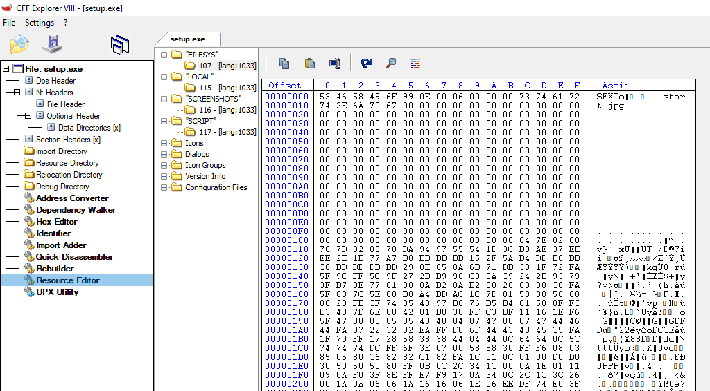

# Crystal Dynamics Setup

A tool for extracting files from the installers used by Crystal Dynamics games until 2008, this installer is also referred to as NixSetup in later games.

This tool only extracts the files embedded in the executable, not the files alongside the installer, these are in common formats like RAR and can be extracted using tools such as 7-Zip or WinRAR.

## Usage

```
dotnet run --revision legacy path/to/installer.exe path/to/output
```

The revision flag is to determine the revision of the format, for all games before 2007 this should be 'legacy' and all other games 'new'.

## Format

The embedded files are stored within file systems located in the executable resources, these resources will have the `IXFS` or `SFXI` magic at the start of the data.



These resources can be extracted and then read as file system, the format is fairly straight forward with the header looking like this.

```c
struct Header
{
    uint32_t magic;
    uint32_t totalSize;
    uint32_t numFiles;
}
```

The `totalSize` field is the total size of the file system, and `numFiles` is the number of files, for which there is a file entry for each of them.

> [!NOTE]
> The file entries are directly located after each other, they are not padded to any boundary.

Each file entry looks like this.

```c
struct File
{
    char name[256];
    uint32_t decompressedSize;
    uint32_t compressedSize;
    char data[compressedSize];
}
```

The `name` field is the null-terminated name of the file, this field is always 256 bytes. The file data is directly located after the last size field, this data is always compressed with Zlib compression.

> [!WARNING]
> The `decompressedSize` was only added in the installer of Tomb Raider: Anniversary, it does not exist in older games.

> [!WARNING]
> Some of the installers have a corrupt last file which is cut off, this file seems to always be `filelist.txt`. It's unknown why this file is consistently corrupt.

## History

> [!NOTE]
> This section is a work in progress, it may currently contain incorrect information.

The installer seems to be first seen on the installation disc of Soul Reaver 2, it was then after used for most games by Crystal Dynamics until 2008 with Tomb Raider: Underworld being the last appearance of this installer.

### 2007

In 2007 the installer was revamped with the release of Tomb Raider: Anniversary, the implementation of the file system code was simplified as well as an extra field being added to the format.

### 2008

With the release of Tomb Raider: Underworld in 2008 the installer code was massively revamped, with the following changes being made to the code.

- The script was replaced with a complete new XML script.
- Hardcoded localised strings were moved from the executable to [SchemaFile](https://cdcengine.re/docs/files/schemafile/) files on the file system.
- Code directly from the Crystal Dynamics engine is now used for internals such as memory allocation.

The setup is now also referred to as NixSetup, which may stand for Nixxes Setup.

For the reading and writing of XML files a proprietary implementation is being pulled from the game engine.

## Script

One of the files embedded with the installer is a script used by the installer to install the files, in installers before 2008 this was a `.txt` file, in newer installers it's an XML file.

The text variant follows a quite simple format where each file is defined by a begin and end instruction.

```ini
[extern]

Begin
	TargetFile	= bigfile.000
	SourceFile	= bigfile.000
	InstallType	= copy
	TargetPath	= %install_path%\
	Disk		= 1
End

Begin
	TargetFile	= bigfile.001
	SourceFile	= bigfile.001
	InstallType	= copy
	TargetPath	= %install_path%\
	Disk		= 1
End
```

A copy of the original file alongside with original documentation can be found in the [data](data/script.txt) folder.

The XML format is more advanced and allows specifying various info alongside of the installable files.

```xml
<NixSetup>

    <Setup
        BackgroundImage="start.jpg"
        LanguageSelectBitmap="laraimage.bmp"
        PathBitmap="pathimage.bmp"
        InstallEndBitmap="doneimage.bmp"
        Mutex="TRUSETUPMTX">
    </Setup>

    <Install	
        InstallFolder="\Eidos\Tomb Raider - Underworld Demo"
        StartMenuFolder="\Eidos\Tomb Raider - Underworld Demo"
        SaveGameFolder="\Eidos\Tomb Raider - Underworld Demo"
        DesktopShortcutName="Tomb Raider - Underworld Demo"
        CompanyRegkey="Crystal Dynamics"
        ProductRegkey="Tomb Raider: Underworld Demo"
        MinPlatformVersion="Win2000"
        GameExeName="TRU.exe"
        GameMutex="TRUMUTEX"
        UninstallExe="uninst.exe"
        NumDisks="1">

        <Files>
            <File Source="bigfile.000" Disk="1" Size="2045"/>
            <File Target="%var:install_path%\binkw32.dll" Source="binkw32.dll" Disk="1"/>
        </Files>
    </Install>

</NixSetup>
```

A complete example of the original file can be found in the [data](data/setup.xml) folder.
